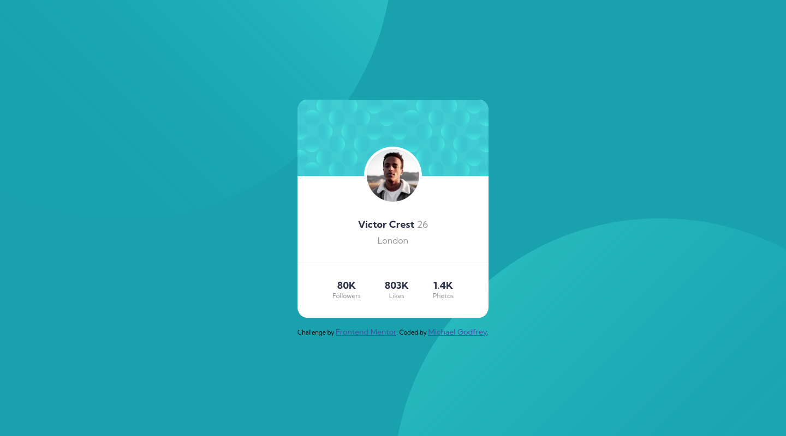

# Frontend Mentor - Profile card component solution

This is a solution to the [Profile card component challenge on Frontend Mentor](https://www.frontendmentor.io/challenges/profile-card-component-cfArpWshJ). Frontend Mentor challenges help you improve your coding skills by building realistic projects.

## Table of contents

- [Overview](#overview)
  - [The challenge](#the-challenge)
  - [Screenshot](#screenshot)
  - [Links](#links)
- [My process](#my-process)
  - [Built with](#built-with)
  - [What I learned](#what-i-learned)
- [Acknowledgments](#acknowledgments)

## Overview

### The challenge

- Build out the project to the designs provided

### Screenshot

### Links

- Solution URL: [solution URL](https://www.frontendmentor.io/solutions/social-media-card-aFIJKE9Z6)
- Live Site URL: [live site URL](https://michagodfrey.github.io/FE-mentor-card/)

## My process

### Built with

- Semantic HTML5 markup
- CSS custom properties

### What I learned

My first Frontend Mentor challenge! This was the first time I got experience how hard it can be to center elements. Also the the background has some subtle effects that are tricky for newbies but I gave it a solid effort and made something pretty decent for a first challenge.

In response to the excellent feedback I was fortunate to receive, I have addressed the accessibility and some other issues.

## Acknowledgments

The pseduo element styles used for the background images were made following the example of Web Wizard's [@rsrclab's solution](https://www.frontendmentor.io/solutions/profile-card-solution-m-cH4D2Lp). 
